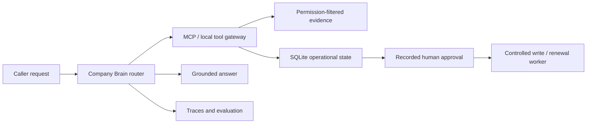

# NovaOps Company Brain

**An AI assistant for internal company operations, with evidence, permissions, and human approval built into its workflows.**

NovaOps helps answer onboarding questions, coordinate IT access requests, extract vendor records, and process renewals. It uses synthetic company data so the workflows can be inspected and replayed without a real employer's systems.

> **Final verified release:** 145/145 tests · 33/33 required-plus-optional evaluation records · 4/4 real process-death recovery stages.

The local showcase presents the recorded release evidence as a five-step demo; use the evaluation commands below to reproduce the deterministic checks.

## Start here

- **Try it:** [five-minute local demo](docs/portfolio-demo.md), including a deterministic run with no model API credentials.
- **Understand it:** [architecture](#architecture) and [implementation evidence](#what-is-implemented).
- **Inspect the results:** [evaluation improvement record](evals/IMPROVEMENT_REPORT.md) and [submission evidence](SUBMISSION.md).
- **Next direction:** [Incident Investigator proposal](docs/aiops-roadmap.md) — planned, not implemented.

## What it does

| Workflow | Example | Boundary |
| --- | --- | --- |
| Maya — onboarding | Answer a policy question with cited evidence | Caller permissions filter retrieval before ranking |
| Webex — IT access | Track an access request through approval | Model text cannot authorize a write |
| Vendor — extraction | Turn a supplied document into a validated CRM record | Missing facts remain missing |
| Renewal — operations | Resume a renewal after an approval event | Persistent state and replay protection govern effects |

**Stack:** Python · AWS Bedrock · MCP · SQLite · Langfuse · FastAPI · Docker

## Course foundation and implementation focus

This is my AI Engineering course capstone, built around the supplied NovaOps brief, synthetic dataset, and evaluation scenarios. The repository documents the implemented application, its controls, and the evidence used to validate it.

The implementation focuses on permission-aware retrieval, durable approval and renewal state, tool-boundary enforcement, binding evaluation checks, trace instrumentation, and adversarial retrieval testing. The [improvement record](evals/IMPROVEMENT_REPORT.md) explains specific defects found and corrected. Course requirements and synthetic scenarios are credited as the foundation; evaluation results are scoped project evidence, not production customer outcomes.

## What is implemented

| Claim | Repository evidence |
| --- | --- |
| One entry point classifies and scopes Maya and Webex requests | `company_brain/agent.py` |
| Actual classify → scope → execute → tools → answer work is traced | `company_brain/instrumentation.py`, `company_brain/observability.py`, `company_brain/tools.py` |
| MCP carries caller identity, scope, and required evidence | `retrieval_mcp_server.py`, `company_brain/tools.py` |
| Manager-only sources are filtered before ranking | `maya/retrieval.py`, `tests/test_canonical_foundation.py` |
| Manager access derives from reporting relationships, not a claimed group | `maya/ops.py`, `tests/test_maya_permissions.py` |
| Operational state and pending approvals survive restart | `maya/ops.py`, `tests/test_access_handoff_resume.py` |
| Model text cannot directly authorize a write | `webex/write_gate.py`, `tests/test_write_gate.py` |
| Existing Webex ticket `T001` and request `AR001` are reused | `webex/workflow.py`, `tests/test_webex_baseline.py` |
| Missing employee-to-seat data is reported rather than inferred | `maya/ops.py`, `tests/test_company_brain_agent.py` |
| Binding golden facts, sources, permissions, and tool-use rules are scored | `evals/binding_checks.py`, `tests/test_submission_runner.py` |
| All 27 required measured turns have a trace index | `SUBMISSION.md`, `evals/run_submission.py` |
| Vendor extraction uses one forced-tool call and validates the supplied schema locally | `vendor/extractor.py`, `tests/test_vendor_extractor.py` |
| Renewal requires scoped approval and clearance, activates on the effective date, survives process death, and replays every event exactly once | `renewal/`, `tests/test_renewal_workflow.py`, `tests/test_lesson15_renewal.py` |
| Adversarial permission, approval, and provider proposals fail closed | `evals/run_guardrail_attacks.py`, `tests/test_guardrail_attacks.py` |
| A typed input guard runs before planning and can be tested independently of server authorization | `company_brain/security.py`, `evals/run_lesson13_offline.py`, `tests/test_input_guard.py` |
| Retrieved content can be semantically screened or quarantined by exact ID/source/SHA-256 before the answer model | `maya/retrieval_security.py`, `tests/test_retrieval_guard.py` |
| A project-specific poison reaches a real OpenSearch-backed Bedrock answer, then is contained, deleted, and cleared from thread memory | `evals/run_lesson13_capstone_poison.py`, `docs/lesson13-capstone-poison-incident.md` |
| API, MCP, and worker ship as separate non-root containers, with a cost-gated AWS/EFS deployment path | `Dockerfile.*`, `docker-compose*.yml`, `deploy/aws/`, `docs/deployment.md` |

## Architecture




`CompanyBrainAgent` owns routing and the shared conversational result contract. Maya and Webex remain focused internal scopes. Vendor is a synchronous document-in/record-out function; Renewal begins from a schedule and resumes on persisted inbound events. All conversational retrieval and operational calls cross a `ToolGateway`, which can run in-process for deterministic tests or against the FastMCP server. SQLite is the source of durable operational, approval, renewal, outbox, and idempotency state; the default database is `.state/novaops.sqlite3` and can be overridden with `NOVAOPS_DB_PATH`.

The dataset deliberately has no employee-to-Webex-seat relationship. Role entitlement is not proof of assignment, so `inspect_software_seat_assignments` returns that limitation explicitly.

## Install and verify

Python 3.11 or newer is required.

```bash
git clone https://github.com/eddieiskl/novaops-company-brain.git
cd novaops-company-brain
python3 -m venv .venv
source .venv/bin/activate
python -m pip install --upgrade pip
python -m pip install -e '.[dev]'
python -m pytest -q
```

Run the committed deterministic evaluations:

```bash
python evals/run_maya_s2.py
python evals/run_maya_s9.py
python evals/run_webex_s8.py
python evals/run_submission.py
python evals/run_submission.py --include-optional
python evals/run_guardrail_attacks.py
python evals/run_lesson13_offline.py
python evals/run_lesson15.py
```

With the synthetic AWS/OpenSearch environment configured, the Lesson 13 live evidence
commands are:

```bash
python evals/run_lesson13_live.py
python evals/run_lesson13_capstone_poison.py
```

The submission runner maps every required measured input to binding expectations from `spec/GOLDEN-DATASETS.json` or an explicit Webex check. It exits non-zero when a required fact/source, permission rule, tool-use rule, or generic safety invariant fails.

## MCP and live model mode

Start the MCP server in one terminal:

```bash
source .venv/bin/activate
python retrieval_mcp_server.py
```

Smoke-test it from another:

```bash
source .venv/bin/activate
NOVAOPS_TOOL_MODE=mcp python scripts/smoke_mcp.py
```

For a traced Bedrock run, create a local `.env` or export credentials for AWS and Langfuse, then run:

```bash
NOVAOPS_TOOL_MODE=mcp NOVAOPS_ANSWER_MODE=bedrock NOVAOPS_GUARD_MODE=bedrock \
  python evals/run_submission.py --include-optional --trace --update-submission
```

This sends synthetic evaluation prompts and retrieved synthetic NovaOps evidence to the configured AWS Bedrock and Langfuse projects. Never commit `.env`; it is ignored.

## Evaluation and observability

Each measured turn creates one Langfuse trace—27 for required scope and 33 with both optional workflows. Multi-turn trace inputs include prior conversation, declared evaluation criteria, and the evidence or verified operation state used by the answer. Large source documents stay in observation inputs rather than propagated metadata. The phase and tool observations wrap live execution, and tool observations record real arguments, results, completion state, and errors. Bedrock answer and structured-extraction calls appear as generation observations. Deterministic score comments explain every result rather than reporting an unexplained aggregate pass.

The bounded improvement record is in `evals/IMPROVEMENT_REPORT.md`. The final trace IDs and reviewed commit are recorded in `SUBMISSION.md`.

GitHub Actions runs pytest, the optional-inclusive 33-case promotion gate, the focused guardrail attacks, Compose validation, and a build of all three container images.

## Completion status

| Stage | Status |
| --- | --- |
| Required Maya workflow | Complete |
| Required Webex workflow | Complete |
| Lesson 11 observability and evaluation | Complete; instructor membership remains an external submission step |
| Lesson 12 eval-loop engineering | Complete for the required scope; before/after gate is documented |
| Vendor workflow | Complete; three schema-valid 0/1/2-gap extractions |
| Renewal workflow | Complete; three scoped, restart-safe, replay-safe outcomes and four process-death recovery checks |
| Lesson 13 security homework | Complete; 16-case live semantic guard, independent enforcement proof, project-specific OpenSearch poisoning/recovery evidence, and application-owned retrieval provenance |
| Lesson 14 packaging/deployment | Historical deployment stage verified on ECS/LiteLLM/EFS: 108 tests, 22 local checks, 16 cloud checks, task-replacement persistence and automatic stop; cleanup verified. See `docs/lesson14-cloud-evidence.md`. |
| Lesson 15 system design and renewal hardening | Complete; PRD review, HLD, as-built record, scoped authority, Finance clearance, effective-date activation, and 145-test acceptance suite. See `design/AS-BUILT.md`. |

## Security and data handling

- Secrets and runtime databases are ignored by Git.
- Regular employees never receive manager-only chunks.
- Direct write tools are absent from Maya’s model-visible loadouts.
- A recorded, assigned human approval is required before a gated write can be released.
- Retrieved chunks must match the application-owned ID/source/SHA-256 corpus manifest; semantic inspection and exact quarantine provide additional containment.
- Quarantined evidence is explicitly invalidated from in-process conversation memory after corpus cleanup.
- Answers distinguish observed facts, actions taken, recommendations, and blockers.

See `SUBMISSION.md` for the deliverable index and `spec/PROJECT-DESCRIPTION.md` for the supplied project brief.

The Lesson 13 boundary map, evidence limitations, offline commands, and live-resumption checklist are in [`docs/lesson13-security-homework.md`](docs/lesson13-security-homework.md). The isolated showcase includes a Security view with live blocked, allowed, and human-review probes that report the tool path and durable-state delta.

## Containers

```bash
IMAGE_TAG="$(git rev-parse HEAD)" docker compose build
IMAGE_TAG="$(git rev-parse HEAD)" docker compose up -d
curl http://127.0.0.1:18080/health/live
curl http://127.0.0.1:18080/health/ready
```

See `docs/deployment.md` for entry points, durability, credentials, cost, cleanup, and cloud-deployment boundaries. `docs/lesson14-cloud-evidence.md` is the reviewer-facing live evidence record.

The [Lesson 14 vendor extension](docs/lesson14-vendor-extension.md) added bounded provider retries, one schema repair, and an SQS consumer sharing the HTTP extraction function. That historical stage passed 118 tests and all three live 0/1/2 missing-field fixtures.

The final [Lesson 15 as-built design](design/AS-BUILT.md) hardens Renewal with scoped authority, explicit Finance and security clearance, source-conflict handling, future-agreement persistence, effective-date activation, and transactional notification intent. The current release passes 145 tests, all 33 required-plus-optional evaluation records, and four real process-death recovery checks. The original course evaluation predates the PRD v1.3 scope fields; the local supplemental fixtures are explicitly labeled under `evals/fixtures/lesson15/`.
