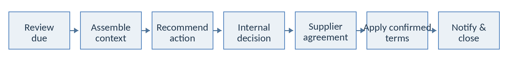

**Product Requirements Document (PRD)**

**NovaOps — SaaS Contract Renewal**

**Document Version: 1.3 \| Status: Approved for Engineering \| Owner: Product / Operations \| Date: 2026-09-22**

An AI-powered service that proactively reviews SaaS renewals, recommends whether to renew, expand, reduce, cancel, or escalate, and drives approved decisions through to completion.

> ***Product goal:** Prevent operational disruption and unnecessary SaaS spend by turning each upcoming renewal into an explicit, evidence-backed business decision — without giving the service authority to approve spending, accept unresolved terms, terminate contracts, or grant employee access.*

# 0. Document control

| **Version** | **Status** | **Change** |
|----|----|----|
| 1.0 | Draft | Initial business requirements, scope, and renewal process definition. |
| 1.1 | Internal Review | Added renewal recommendations, utilization context, stakeholder responsibilities, and success measures. |
| 1.2 | Engineering Review | Validated requirements against NovaOps records and policy sources; identified source-precedence, approval-scope, recommendation, and delivery-semantics issues. |
| 1.3 | Approved for Engineering | Product decisions confirmed source precedence, approval interpretation, recommendation boundaries, and reliable delivery behavior; acceptance criteria aligned. |

# 1. Problem

In a recent NovaOps incident, a new employee could not receive a required Webex license and needed almost two weeks to become productive instead of the intended two working days. The immediate investigation found a capacity problem: the organization had more active Webex seats than the current contract allowed. IT, Finance, and Legal had to interrupt planned work to resolve the situation urgently.

The investigation exposed a second failure. The Webex contract was already approaching expiry and its renewal notice deadline had passed. More broadly, NovaOps has no consistent process for deciding what should happen at renewal time: keep the current terms, expand capacity, reduce unused licenses, cancel a service, or escalate an uncertain case. The same gap can create both operational disruption and unnecessary SaaS spend.

# 2. Vision statement

NovaOps wants an AI-powered renewal manager that proactively reviews in-scope SaaS contracts, brings together the current business context, recommends the appropriate next step, and follows the approved decision through supplier communication and operational completion.

Each review should reach one explicit outcome: renew as-is, expand, reduce, cancel, or escalate for human review. Success includes a timely decision not to proceed; renewing every contract is not the goal.

# 3. Scope

## 3.1 In scope

Identify upcoming or overdue renewals; assemble the relevant contract, capacity, utilization, demand, cost, ownership, and policy context; recommend an evidence-backed renewal action; obtain the required internal decisions; communicate approved requests to suppliers; assess their replies; record confirmed terms and their effective dates; and notify affected parties when an operational constraint actually changes.

The first release covers the NovaOps SaaS portfolio. Webex is the first complete acceptance case, not a vendor-specific product design. Other contracts may result in renew-as-is, reduction, cancellation-review, or escalation recommendations. Unsupported situations must remain visible and assigned for review rather than being silently ignored.

## 3.2 Out of scope

Autonomous negotiation, contract signature, payments, unilateral cancellation, legal opinions, employee provisioning, seat reclamation, a general-purpose employee chatbot, vendor selection, and company-wide spend forecasting are not part of this release. The service may recommend reducing or cancelling a contract, but it may not make that commitment without the required human authority. A notification that capacity changed is not permission to use a system.

# 4. Core user journeys

| **Journey** | **Business trigger** | **Required outcome** |
|----|----|----|
| J1 — Attention required | A contract approaches its review or notice deadline, is overdue, or another business signal makes review necessary | The case is opened with the current contract, dates, capacity/utilization, demand, cost, ownership, policy context, and why attention is needed. |
| J2 — Renewal recommendation | Enough current business context is available to assess the renewal | A recommended outcome — renew as-is, expand, reduce, cancel, or escalate — is presented with rationale, commercial/operational impact, and any uncertainty. |
| J3 — Internal decision | An owner or required reviewer responds | The decision, its exact scope, and any outstanding approvals are clear. A recommendation does not become authority by itself. |
| J4 — Supplier interaction | The approved direction requires supplier action, or a supplier replies | The approved request is communicated accurately; a final agreement is distinguished from an offer, condition, refusal, ambiguity, or missing information. |
| J5 — Terms take effect | Confirmed changes become effective | Business records reflect the effective terms; affected parties receive a truthful update. |
| J6 — Exception or interruption | A deadline is missed, evidence conflicts, an approval is missing, or work is interrupted | The case remains owned and visible with an explicit reason, deadline, and next action; prior decisions are not lost. |

## Business journey

*Figure 1. Business outcomes only; this is not a prescribed technical workflow.*

## People and responsibilities

| **Participant** | **Responsibility** | **Boundary** |
|----|----|----|
| Contract owner / IT owner | Confirm the business need, current capacity/utilization, operational demand, and whether the recommendation matches what the team actually needs. | Cannot waive another required review, approval, or supplier condition. |
| Authorized approver | Approve or reject a specific renewal, expansion, reduction, or cancellation request. | An approval is scoped; it is not an unlimited spending or termination mandate. |
| Finance | Resolve spend applicability, commercial ambiguity, and financial implications of right-sizing decisions. | Applies current policy and may involve other reviewers. |
| Security / Legal | Provide required specialist review for data, security, or contractual risk. | No clearance or legal conclusion may be assumed from silence. |
| Affected employee | Receive relevant access-impact updates when a capacity constraint changes. | Does not receive confidential commercial details or automatic access. |

# 5. Functional requirements

## 5.1 Business information required

The service needs current contract terms and notice obligations; subscription capacity and active-seat utilization; current annual cost; the accountable owner and authorized reviewers; applicable policies and amendments; relevant blocked or pending demand; prior decisions and approvals; and supplier correspondence. Product expects the AI to reason over this information as one renewal case, regardless of which business system currently holds each fact. Where sources disagree, the conflict and applicable source-of-truth rule must remain visible; unresolved source precedence prevents a binding action.

Conflicting or absent information is an outcome to report, not an invitation to guess. Each review must distinguish recorded facts, the system's recommendation, an approved request, a supplier proposal, a confirmed agreement, and the terms currently in effect.

## 5.2 Required capabilities

| **ID** | **Requirement** | **Priority** |
|----|----|----|
| FR-01 | Identify contracts requiring attention without an employee first reporting a problem. Distinguish review opening, notice deadline, expiry, and other business signals that make a review relevant. | P0 |
| FR-02 | Surface overdue obligations and urgent cases, including known capacity-related access impact. Show why attention is needed now. | P0 |
| FR-03 | Prepare a renewal context containing current terms, capacity and active-seat utilization, cost, owner, operational demand, applicable policy, approvals, and missing or conflicting evidence. Do not silently resolve ownership or commercial conflicts when the governing source is unclear. | P0 |
| FR-04 | Produce an evidence-backed recommendation: renew as-is, expand, reduce, cancel, or escalate. Explain the rationale, expected commercial/operational impact, and uncertainty. A recommendation is not authorization. | P0 |
| FR-05 | Identify the required internal decision-makers under the applicable policy. Unresolved ownership or approval requirements prevent progression. | P0 |
| FR-06 | Obtain and retain approval for a specific request: action, scope, spending limit, term, effective date, and required clearances. Changes outside that approval require another decision. | P0 |
| FR-07 | Send a supplier request only after the required internal approval. Describe existing facts and the approved request accurately. | P0 |
| FR-08 | Distinguish a final supplier agreement from a conditional offer, rejection, ambiguity, missing information, or a reply about another contract. | P0 |
| FR-09 | Record agreement only when the supplier's confirmed terms match the authorized request and all required information and clearances are present. | P0 |
| FR-10 | Keep future agreements separate from currently effective capacity and terms. Apply changes no earlier than their confirmed effective date. | P0 |
| FR-11 | Notify affected parties when the relevant constraint actually changes. Do not claim access has been granted, and do not expose unnecessary commercial information. | P0 |
| FR-12 | Retain progress and decisions across interruptions. Repeated handling of the same decision, message, or reply must not create a second commitment or duplicate business update. | P0 |
| FR-13 | Keep unresolved cases visible, with an owner, reason, next action, recommendation status, and relevant deadline. Record what was actually done, not merely what was suggested. | P0 |

## 5.3 Review and outcome presentation

A reviewer must be able to see the contract and supplier; current and requested terms; dates and urgency; capacity/utilization and operational demand; current cost; the system's recommendation and rationale; supporting sources; required and completed decisions; supplier status; current outcome; and the next responsible party. An incomplete case must say what is missing. No particular screen, message layout, or document format is mandated.

# 6. Service expectations and success measures

The following are **proposed pilot targets**, not historical measurements or guarantees about third-party response times.

| **ID** | **Expectation** | **Pilot target / acceptance meaning** |
|----|----|----|
| NFR-01 | Timely attention | Each in-scope contract is assessed at least daily. A newly identified urgent or overdue case is brought to its owner within one working day. |
| NFR-02 | Prompt processing | 95% of received decisions and supplier replies produce an updated case outcome within 15 minutes when dependent services are available. Human and supplier waiting time is excluded. |
| NFR-03 | Availability and continuity | Target 99.5% monthly service availability. Recorded decisions survive interruption; after a recoverable service interruption, work resumes within 15 minutes of service restoration. |
| NFR-04 | Controlled authority | No unauthorized spending commitment, premature activation, or employee access grant in acceptance tests. A missed deadline does not waive approval. |
| NFR-05 | Reliable record-keeping | No duplicate commercial change on repeated handling. Uncertain message delivery remains visible rather than being reported as successful. |
| NFR-06 | Explainability and confidentiality | Every applied change is traceable to its internal approval and supplier confirmation. People see only information needed for their role. |

**Business measures:** track renewals first raised before their notice deadline; unresolved overdue cases; renewal decisions by outcome (renew as-is / expand / reduce / cancel / escalate); right-sizing opportunities identified before renewal; avoidable access delays attributed to renewal/capacity oversight; and unplanned escalation effort. The pilot aims for zero silent missed in-scope renewals. Savings or spend impact should be reported only where the available commercial data supports it.

# 7. Business rules and reference case

## 7.1 Rules governing the release

Review normally opens 90 days before contract expiry. The contract determines its own notice deadline. A notice deadline within the next 45 days is urgent; an overdue unresolved notice deadline remains urgent.

Capacity utilization and operational demand are inputs to a renewal recommendation, not automatic decisions. Low utilization may justify reviewing a smaller commitment or cancellation; over-capacity or blocked demand may justify expansion. The recommendation must remain separate from the human authority required to commit NovaOps.

An expansion above USD 7,500 in annualized **incremental** spend requires Finance approval during Q3 2026. The newer Q3 memo supersedes the older USD 5,000 threshold. That threshold is not an exemption from a separate outstanding approval, a security review, or a condition imposed by the supplier.

Ambiguous commercial terms go to Finance for a ruling; specialist review is involved as applicable. Nobody may resolve a binding ambiguity simply by choosing the most convenient source.

An agreement and its activation are separate business events. A supplier's final agreement for a future term may be recorded now, but it does not establish that additional capacity is usable today.

## 7.2 Webex — concrete acceptance case

| **Item** | **Reference fact** |
|----|----|
| Review date | 2026-07-01. The current Webex contract is still in force. |
| Contract / subscription | C001 / SUB001; 40 contracted seats and 42 active seats. |
| Contract dates | Current term ends 2026-07-20; review opened 2026-04-21; 45-day notice deadline was 2026-06-05. |
| Operational impact | Rachel Stein's existing Webex access request AR001 is blocked by capacity; the portfolio review also exposes the renewal risk before the contract expires. |
| Renewal recommendation | Expansion review: current active seats already exceed the 40-seat commitment and blocked demand exists. The reference request is to renew with 50 seats; this recommendation is not authorization. |
| Requested expansion | 50 seats. Amir Haddad, IT Manager, is the internal expansion approver. |
| Current / proposed annual price | USD 18,400 / USD 22,000: an annualized increase of USD 3,600. |
| Final supplier reply | Confirmation RX-WEBEX-2026-8841, 50 seats, USD 22,000, term 2026-07-21 to 2027-07-20. |

Rachel's current request is a concrete operational impact of the Webex capacity issue. Other portfolio reviews may legitimately produce renew-as-is, reduction, cancellation-review, or escalation recommendations.

**Happy-path preconditions: approval must cover the price ceiling and term, the required security review must be complete, and any outstanding Finance hold must be resolved. If any precondition is missing, the case must remain pending human resolution rather than assume approval.**

## 7.3 Four supplier outcomes

| **Supplier response** | **Business outcome** |
|----|----|
| Final and complete agreement, matching approval | Record the confirmation. Before 2026-07-21, show “confirmed, awaiting effective date.” On that date, apply the authorized change once and notify affected parties. |
| Offer subject to signature and Finance acceptance | Keep current commercial records unchanged; request resolution of the explicit conditions. |
| Refusal of the proposed terms | Report rejection and return the case to its owner for a decision. Do not cancel the current agreement automatically. |
| “Looks good” with final details still to follow | Report that final confirmation is missing. Do not infer a price, term, or completed renewal. |

A supplier confirmation for a future term must not be treated as immediately effective. Operational records change only when the confirmed terms take effect.

# 8. Acceptance criteria

| **ID** | **Given / when** | **Required result** |
|----|----|----|
| AC-01 | The portfolio is reviewed at the reference date | Webex is identified as urgent and overdue for notice, not as an already expired contract. Other contracts are assessed from their own terms and current business context. |
| AC-02 | A renewal context is prepared | Current capacity/utilization, dates, cost, owner, operational demand, policy basis, approvals, and unresolved review needs are supported by the relevant records. |
| AC-03 | A recommendation is produced | The recommendation states renew as-is, expand, reduce, cancel, or escalate, with rationale and uncertainty. Webex recommends expansion review; low utilization alone does not trigger automatic cancellation. |
| AC-04 | A decision is missing, unauthorized, rejected, or outside its approved scope | No supplier commitment or commercial update is made. The outstanding decision is visible. |
| AC-05 | All internal preconditions are satisfied | One accurate supplier request is issued for the approved scope; the decision history is preserved. |
| AC-06 | The final Webex confirmation arrives on July 3 | The future agreement is recorded. Current capacity remains 40 until the confirmed effective date; no “capacity now available” notice is issued early. |
| AC-07 | The approved change becomes effective on July 21 | Applicable contract/subscription records change once; recorded active usage is not fabricated or reset; affected employees are notified without being granted access. |
| AC-08 | A reply is conditional, rejected, ambiguous, incomplete, or mismatched | No commercial change is applied; the case identifies the reason and responsible next party. |
| AC-09 | Work is interrupted or the same decision/reply is handled again | Previously recorded decisions remain available; no duplicate business effect occurs. An uncertain delivery result is not represented as confirmed delivery. |
| AC-10 | An affected employee receives an update | The message describes the actual change and next step, without confidential pricing or a false access-grant claim. |
| AC-11 | A reviewer inspects any outcome | They can distinguish facts, recommendation, requested action, approval, supplier confirmation, effective change, and communication, and see the evidence behind each. |

# 9. Stakeholder notes from discovery

The following are **unapproved stakeholder suggestions**, included to preserve the context and AI ambition behind the request. They are not acceptance criteria and do not override sections 3–8. Some are intentionally solution-shaped, optimistic, or irrelevant; engineering is expected to separate the underlying need from the proposed implementation.

| **ID** | **Stakeholder comment** |
|----|----|
| SC-01 | Product sponsor: “We already have RAG in the company. Can we connect the contracts, subscription data, approvals, and policies to RAG and let the AI figure out what needs renewal?” |
| SC-02 | Product sponsor: “Ideally the AI agent should monitor every contract continuously and wake itself up only when something needs attention.” |
| SC-03 | Operations: “Can the AI automatically optimize SaaS spend — renew healthy contracts, reduce low-utilization licenses, and only bother people when it is uncertain?” |
| SC-04 | Procurement: “For routine vendors, could the AI email back and forth and negotiate seat counts or pricing until it reaches an acceptable deal?” |
| SC-05 | Operations: “To avoid another delay, perhaps a supplier saying ‘looks good’ could be enough to mark the renewal done.” |
| SC-06 | Brand team: “Please reuse the blue banner from the next company webinar in the renewal summary.” |
| SC-07 | IT owner: “Slack would be convenient for internal decisions, but I care more about not losing the request than about the channel.” |
